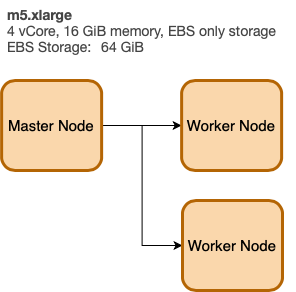
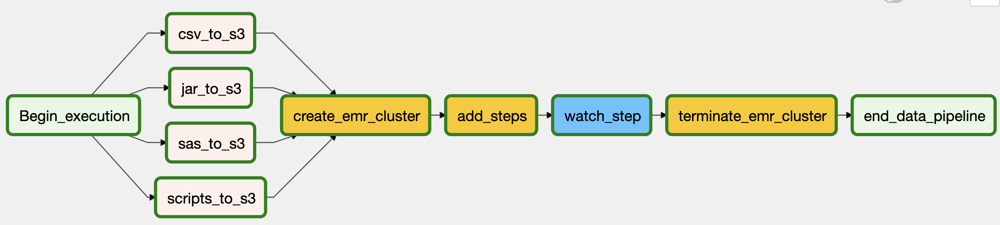
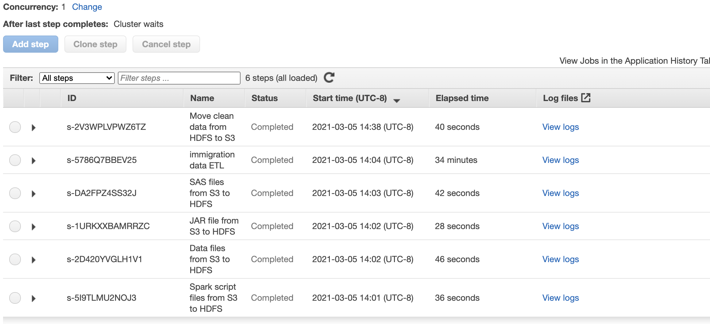

# Airflow + Spark + AWS EMR

----

## Project Description

For this project we are using these primary data sets:

- **I94 Immigration Data:** This data comes from the US National Tourism and Trade Office. A data dictionary is included in the workspace. [This](https://travel.trade.gov/research/reports/i94/historical/2016.html) is where the data comes from. There's a sample file so you can take a look at the data in csv format before reading it all in. You do not have to use the entire dataset, just use what you need to accomplish the goal you set at the beginning of the project.
- **World Temperature Data:** This dataset came from Kaggle. You can read more about it [here](https://www.kaggle.com/berkeleyearth/climate-change-earth-surface-temperature-data).
- **U.S. City Demographic Data:** This data comes from OpenSoft. You can read more about it [here](https://public.opendatasoft.com/explore/dataset/us-cities-demographics/export/).
- **Airport Code Table:** This is a simple table of airport codes and corresponding cities. It comes from [here](https://datahub.io/core/airport-codes#data).
- Additionally there is a SAS Description file that we extract its content to create lookup tables for the all the codes in the immigration data. 

## Scenario :

Business wants to start analyzing the data sets, but they are not happy with the current system and want to migrate from their legacy SAS system. They asked to convert the SAS datasets from `sas7bdat` files to `parquet` and store them in a Data Lake (S3). The project was driven by the need to migrate to the Cloud (AWS) to make the data accessible to other groups (data science and BI teams). ETL (Extract, Transform and Load) processes were performed to prepare the data. 

> **Goal** Migrate legacy system files (SAS Datasets) from on-premise to the cloud and store in a Data Lake (S3). This will later support the Business Intelligence, and Data Science teams in their activities. Business Intelligence team can source the data from the Data Lake and inject into their Data Warehouse.

Business does not have a defined use-case for the data at the moment, but they know for sure they want to migrate away from SAS to another system. The SAS files are large and on a local server (on-premise). They want to make sure the data is formatted and migrated to the cloud for future uses by other departments. This is part of their cloud migration strategy and AWS was selected for this engagement. 

The Data Lake will be in Parquet file format hosted on S3 files. The Raw files will also reside in S3 for future archiving and backup.

---

### Project Plan

In this project we will demonstrate the use of:

* **Airflow** to orchestrate and manage the data pipeline
* **AWS EMR** for the heavy data processing 
* Use **Airflow** to create the EMR cluster, and then terminate once the processing is complete to save on cost.

The overall project consists of the following steps:

1. **Gather** the SAS files that are part of this project. Currently there are 2.4 GB worth of data files (4 SAS files for the immigration data for April, May, June, and July). There is also a CSV file as well as a data file that contains descriptions which will be used to create lookup tables.
2. **Migrate** the data from on-premise repository (local) to S3 cloud as a staging area
3. **Create** an EMR cluster to process the files. 
   1. Add two new columns: Age-Groups and Age-Categories (using **SparkML** Bucketizer)
   2. Cluster the data into 3 clusters based on KMeans clustering algorithm 
   3. Parse the SAS date format for Departure and Arrival dates to a regular Date Format
   4. Filter the Temperature files and perform additional group-by related transformations 
4. **Push** final tables/files into an S3 bucket as Parquet file format

> **Summary** data transformation includes:
>
> 1. Convert SAS date format into readable date format
> 2. Create Age Group, and Age Category, and Cluster columns 
> 3. Temperature data filtered to USA only and averaged by month and city for year > 2003.. Added Year and Month Column
> 4. Create lookup tables for the codes found in the SAS Description file 

---

### What this project demonstrates

* Using **Airflow** to manage the data pipeline and orchestrate the overall flow. Using **AWS EMR** to do the heavy ETL processes using **PySpark**. And finally, leverage **SparkML** to perform Bucketization, and KMeans clustering. 
* Leverage the power of **Spark** for distributed processing to speed up transformation and processing of large SAS datasets (around 13-14M records and 2.6 GB in file sizes). 
* Demonstrate how **Airflow** can play a key role in the corporate strategy for:
  * Managing data pipelines
  * Data Lineage and Data Quality controls
  * Manage AWS resources such as spinning an EMR cluster and then terminating upon job completion. 

---

### Reference Architecture 

**Overall Architecture** 


**EMR Architecture**




---

# File Structure 

```
├── airflow.sh
├── dags
│   ├── dag.py
│   ├── data
│   │   ├── SAS_data
│   │   │   └── i94_apr16_sub.sas7bdat
│   │   └── csv
│   │       ├── GlobalLandTemperaturesByCity.csv
│   │       ├── airlines.csv
│   │       └── airports.csv
│   ├── jars
│   │   └── spark-sas7bdat-2.0.0-s_2.11.jar
│   └── scripts
│       ├── __init__.py
│       ├── data_values.py
│       └── spark_etl.py
├── docker-compose.yaml
├── logs
└── plugins
```


* Three main folders which are needed when running Airflow Docker image (see blew instructions). This will mount a docker volume so Airflow running inside the container can access our files from outside. 
* `dags folder` 
  * The main file is the `dag.py` which defines the DAG in Airflow. This file contains the flow, Spark Steps (steps performed once the EMR cluster is running), and EMR configuration (EMR architecture including number of instances, size ..etc)
  * `data folder` which contains two subfolders: `csv` folder for CSV files and `SAS_data` for our SAS `sas7bdat` files.
  * `jar` folder which contains any additional JAR files that we need in our EMR Cluster. This can be helpful in cases were we are not able to install needed JAR/packages directly. In most cases installation should work using either `spark-shell` like this `spark-shell --master local[4] --packages saurfang:spark-sas7bdat:3.0.0-s_2.12` or using `--packages` in `spark-submit` like this `spark-submit --packages saurfang:spark-sas7bdat:2.0.0-s_2.11 spark_etl.py`
  * `scripts` folder contains our main `spark_etl.py` file which we will execute inside the cluster via `spark-submit` command. This file contains the entire ELT logic. 


# Overall Flow

1. Migrate all the local data, scripts, and support JAR files from on-premise to S3
2. Create the EMR Cluster as defined in the JOB_FLOW_OVERRIDES (JSON). We will be using several Airflow available operators such as `EmrCreateJobFlowOperator`, `EmrAddStepsOperator`,`EmrStepSensor`, `EmrTerminateJobFlowOperator`
3. Once the cluster is up and running, we will migrate all the need files from S3 to the cluster to be processed inside the cluster. The JAR file will be copied to `/usr/lib/spark/jars/`, the data files will all be moved to `/source` folder.
4. There are multiple Spark Steps defined. These steps take place inside the cluster. The final output of the ETL though will write the `parquet` to a local folder named `output` that is inside the cluster. The final step, will copy these file from the local cluster to S3 in a folder named `output` as well
5. Once copying the files is completed, the cluster will be terminated.

The DAG below summarized these steps 




# Define the Cluster

We define the cluster architecture using a key-value structure (like JSON). Here we define a Master Node `m5.xlarge` and (2) worker nodes also `m5.xlarge`.  The LogUri defined to be on S3.

```json
JOB_FLOW_OVERRIDES = {
    "Name": "Capstone_Project",
    "ReleaseLabel": "emr-5.28.0",
    "Applications": [{"Name": "Hadoop"}, {"Name": "Spark"}],
    "Configurations": [
        {
            "Classification": "spark-env",
            "Configurations": [
                {
                    "Classification": "export",
                    "Properties": {"PYSPARK_PYTHON": "/usr/bin/python3",  "JAVA_HOME": "/usr/lib/jvm/java-1.8.0"},
                },
            ],

        },
    ],
    "Instances": {
        "InstanceGroups": [
            {
                "Name": "Master node",
                "Market": "ON_DEMAND",
                "InstanceRole": "MASTER",
                "InstanceType": "m5.xlarge",
                "InstanceCount": 1,
            },
            {
                "Name": "Core Node",
                "Market": "ON_DEMAND",
                "InstanceRole": "CORE",
                "InstanceType": "m5.xlarge",
                "InstanceCount": 2,
            },
        ],
        "KeepJobFlowAliveWhenNoSteps": True,
        "TerminationProtected": False,
    },
    "JobFlowRole": "EMR_EC2_DefaultRole",
    "ServiceRole": "EMR_DefaultRole",
    "LogUri": "s3://udacity-capstone-2021/job",
    "VisibleToAllUsers": True
}
```

---

# Spark Steps

**When to use bootstrap actions vs steps in AWS EMR?**

> Use bootstrap actions to install additional software on an EMR cluster. Use steps to submit work to an EMR cluster, or to process data.

 In here will use EMR Steps and define 6 steps:

1. Copy script files from S3 source to EMR Cluster under `source` folder
2. Copy data files  from S3 source to EMR Cluster under `source` folder
3. Copy JAR files  from S3 source to EMR Cluster under `source` folder
4. Copy SAS file  from S3 source to EMR Cluster under `/usr/lib/spark/jars/` folder 
5. Execute the `spark_etl.py` file through `spark-submit` command
6. Copy the processed data (parquet files) from `output` folder inside the cluster to S3 bucker inside an `output` folder



Here is how we define these steps highlights above. This is done using key-value structure (Dictionary) inside a python list. 

```json
SPARK_STEPS = [
    {
        "Name": "Spark script files from S3 to HDFS",
        "ActionOnFailure": "CANCEL_AND_WAIT", 
        "HadoopJarStep": {
            "Jar": "command-runner.jar",
            "Args": [
                "s3-dist-cp",
                "--src=s3://{{ params.BUCKET_NAME }}/{{ params.s3_script }}",
                "--dest=/source",
            ],
        },
    },
    {
        "Name": "Data files from S3 to HDFS",
        "ActionOnFailure": "CANCEL_AND_WAIT",
        "HadoopJarStep": {
            "Jar": "command-runner.jar",
            "Args": [
                "s3-dist-cp",
                "--src=s3://{{ params.BUCKET_NAME }}/{{ params.s3_data}}",
                "--dest=/source",
            ],
        },
    },
    {
        "Name": "JAR file from S3 to HDFS",
        "ActionOnFailure": "CANCEL_AND_WAIT",
        "HadoopJarStep": {
            "Jar": "command-runner.jar",
            "Args": [
                "s3-dist-cp",
                "--src=s3://{{ params.BUCKET_NAME }}/{{ params.jar_files}}",
                "--dest=/usr/lib/spark/jars/",
            ],
        },
    },
    {
        "Name": "SAS files from S3 to HDFS",
        "ActionOnFailure": "CANCEL_AND_WAIT",
        "HadoopJarStep": {
            "Jar": "command-runner.jar",
            "Args": [
                "s3-dist-cp",
                "--src=s3://{{ params.BUCKET_NAME }}/{{ params.sas_files}}",
                "--dest=/source",
            ],
        },
    },
    {
        "Name": "immigration data ETL",
        "ActionOnFailure": "CANCEL_AND_WAIT",
        "HadoopJarStep": {
            "Jar": "command-runner.jar",
            "Args": [
                "spark-submit",
                "--packages",
                "saurfang:spark-sas7bdat:2.0.0-s_2.11",
                "--deploy-mode",
                "client",
                "s3://udacity-capstone-2021/source_files/scripts/spark_etl.py",
            ],
        },
    },
    {
        "Name": "Move clean data from HDFS to S3",
        "ActionOnFailure": "CANCEL_AND_WAIT",
        "HadoopJarStep": {
            "Jar": "command-runner.jar",
            "Args": [
                "s3-dist-cp",
                "--src=/output",
                "--dest=s3://{{ params.BUCKET_NAME }}/{{ params.s3_clean }}",
            ],
        },
    },
]

```

---

# ETL Code

There are two main functions in the code.

1. **process_data** which does the heavy ETL process. 
   1. Read the `sas7bdat` file and convert into a Spark data frame
   2. Select relevant columns 
   3. Partition (repartition) to improve performance 
   4. Using SparML Bucketizer to transform the data frame and add new columns (buckets/bins)

----

# Run Airflow on Docker

To deploy Airflow on Docker Compose, you should fetch [docker-compose.yaml](https://airflow.apache.org/docs/apache-airflow/stable/docker-compose.yaml).

```bash
curl -LfO 'https://airflow.apache.org/docs/apache-airflow/2.0.1/docker-compose.yaml'
```

This file contains several service definitions:

- `airflow-scheduler` - The [scheduler](https://airflow.apache.org/docs/apache-airflow/stable/scheduler.html) monitors all tasks and DAGs, then triggers the task instances once their dependencies are complete.
- `airflow-webserver` - The webserver available at `http://localhost:8080`.
- `airflow-worker` - The worker that executes the tasks given by the scheduler.
- `airflow-init` - The initialization service.
- `flower` - [The flower app](https://flower.readthedocs.io/en/latest/) for monitoring the environment. It is available at `http://localhost:8080`.
- `postgres` - The database.
- `redis` - [The redis](https://redis.io/) - broker that forwards messages from scheduler to worker.

All these services allow you to run Airflow with [CeleryExecutor](https://airflow.apache.org/docs/apache-airflow/stable/executor/celery.html). For more information, see [Basic Airflow architecture](https://airflow.apache.org/docs/apache-airflow/stable/concepts.html#architecture).

Some directories in the container are mounted, which means that their contents are synchronized between your computer and the container.

- `./dags` - you can put your DAG files here.
- `./logs` - contains logs from task execution and scheduler.
- `./plugins` - you can put your [custom plugins](https://airflow.apache.org/docs/apache-airflow/stable/plugins.html) here.


### Initializing Environment

Before starting Airflow for the first time, You need to prepare your environment, i.e. create the necessary files, directories and initialize the database.

On **Linux**, the mounted volumes in container use the native Linux filesystem user/group permissions, so you have to make sure the container and host computer have matching file permissions.

```bash
mkdir ./dags ./logs ./plugins
echo -e "AIRFLOW_UID=$(id -u)\nAIRFLOW_GID=0" > .env
```

On **all operating system**, you need to run database migrations and create the first user account. To do it, run.

```bash
docker-compose up airflow-init
```

After initialization is complete, you should see a message like below.

```bash
airflow-init_1       | Upgrades done
airflow-init_1       | Admin user airflow created
airflow-init_1       | 2.0.1
start_airflow-init_1 exited with code 0
```

The account created has the login `airflow` and the password `airflow`.

### Running Airflow

Now you can start all services:

```bash
docker-compose up
```

In the second terminal you can check the condition of the containers and make sure that no containers are in unhealthy condition:

```bash
$ docker ps
CONTAINER ID   IMAGE                  COMMAND                  CREATED          STATUS                    PORTS                              NAMES
247ebe6cf87a   apache/airflow:2.0.1   "/usr/bin/dumb-init …"   3 minutes ago    Up 3 minutes              8080/tcp                           compose_airflow-worker_1
ed9b09fc84b1   apache/airflow:2.0.1   "/usr/bin/dumb-init …"   3 minutes ago    Up 3 minutes              8080/tcp                           compose_airflow-scheduler_1
65ac1da2c219   apache/airflow:2.0.1   "/usr/bin/dumb-init …"   3 minutes ago    Up 3 minutes (healthy)    0.0.0.0:5555->5555/tcp, 8080/tcp   compose_flower_1
7cb1fb603a98   apache/airflow:2.0.1   "/usr/bin/dumb-init …"   3 minutes ago    Up 3 minutes (healthy)    0.0.0.0:8080->8080/tcp             compose_airflow-webserver_1
74f3bbe506eb   postgres:13            "docker-entrypoint.s…"   18 minutes ago   Up 17 minutes (healthy)   5432/tcp                           compose_postgres_1
0bd6576d23cb   redis:latest           "docker-entrypoint.s…"   10 hours ago     Up 17 minutes (healthy)   0.0.0.0:6379->6379/tcp             compose_redis_1
```

### Accessing the environment

After starting Airflow, you can interact with it in 3 ways;

- by running [CLI commands](https://airflow.apache.org/docs/apache-airflow/stable/usage-cli.html).
- via a browser using [the web interface](https://airflow.apache.org/docs/apache-airflow/stable/ui.html).
- using [the REST API](https://airflow.apache.org/docs/apache-airflow/stable/stable-rest-api-ref.html).

 ####  Running the CLI commands

You can also run [CLI commands](https://airflow.apache.org/docs/apache-airflow/stable/usage-cli.html), but you have to do it in one of the defined `airflow-*` services. For example, to run `airflow info`, run the following command:

```bash
docker-compose run airflow-worker airflow info
```

If you have Linux or Mac OS, you can make your work easier and download a optional wrapper scripts that will allow you to run commands with a simpler command.

```bash
curl -LfO 'https://airflow.apache.org/docs/apache-airflow/2.0.1/airflow.sh'
chmod +x airflow.sh
```

Now you can run commands easier.

```bash
./airflow.sh info
```

You can also use `bash` as parameter to enter interactive bash shell in the container or `python` to enter python container.

```bash
./airflow.sh bash
```


```bash
./airflow.sh python
```

### Cleaning up

To stop and delete containers, delete volumes with database data and download images, run:

```bash
docker-compose down --volumes --rmi all
```

## Notes

By default, the Docker Compose file uses the latest Airflow image ([apache/airflow](https://hub.docker.com/r/apache/airflow)). If you need, you can [customize and extend it](https://airflow.apache.org/docs/apache-airflow/stable/production-deployment.html#docker-image).